# 代码说明

### `更新`

1. **绘画部分改进**，**MyPaint**类原本直接操纵底层的各个需要绘图的人物，拥有各种人物的绘图方法，如下所示：

    ```java
    public class MyPaint extends Canvas{
        private NMap nMap;                                      //地图
        private CalabashTeam calabashTeam;                      //葫芦兄弟
        private EnemyTeam enemyTeam;                            //敌人队伍
        private GrandFather grandFather;  						//老爷爷
        …………
        private void draw(Picture picture, GraphicsContext graphicsContext);	//画出图片
        private void drawMap();									//画地图
        private void drawcalabashTeam();						//画葫芦娃队伍
        private void drawenemyTeam();							//画敌人队伍
        private void drawSnake();								//画蛇精
        private void drawGrand();								//画老爷爷
        …………
    }
    ```

    * **这样的方式实则为结构化方法，高层模块依赖于底层模块，程序中的依赖关系终止于具体的类，违反了*<font color=#aa99ff>DIP</font>*原则。**

    * **同时，这样的设计在有新的需求时，需要改动原本已经写好的代码，可维护性差，并没有做到对扩展开放，违反了<font color=#aa99ff>*OCP*</font>原则**
    * **没有使用基类来统一各个函数，而是为每个子类单独完成函数，违反了*<font color=#aa99ff>LSP</font>*原则**

    改进后：

    * 将画图抽象出**基类DrawBase**，每个具体需要绘制的人物**继承DrawBase**，这样在有新的需要绘制的人物时只需要从DrawBase中派生出一个新的类即可，遵循了**<font color=#aa99ff>OCP</font>**原则。

    * 同时增加**抽象服务类DrawServer**，高层MyPaint**依赖于DrawServer类**，不直接依赖于各个底层类，遵循了**<font color=#aa99ff>DIP</font>**原则。

    * DrawServer类中**参数为基类DrawBase对象**，而不是各个具体的派生类，实际调用时用子类型低缓基类型，实现了一个draw函数完成所有具体派生类的绘画，遵循了**<font color=#aa99ff>LSP</font>**原则。

    * 如下为代码结构示意：

        ```java
        //基类：DrawBase
        public class DrawBase{
            void drawPic(Picture picture);						//绘制一个图片
            public void draw();									//绘制具体的一个对象，用于重写
        }
        //派生类：葫芦娃队伍
        public class DrawCalabashTeam extends DrawBase{
            private CalabashTeam calabashTeam;					//需要绘制的对象：葫芦娃队伍
            public void draw();									//重写方法，绘制葫芦娃逻辑
        }
        ………………
        //绘画服务，提供给上层
        public class DrawServer{
            public void draw(DrawBase drawBase){				//使用基类参数，子类替换基类
                drawBase.draw();
            }
        }
        ```

    * 以下为类图:

        

2. 同理，**改进了人物基类Character的移动方式**。原本人物移动直接调用底层方法，违背了***<font color=#aa99ff>DIP，LSP，OCP</font>***原则。改进后，**抽象出接口MoveInterface，向各个方向的移动implements接口，并且增加移动抽象服务类MoveServer，用接口参数MoveInterface统一所有移动，提供给上层Character。**

    ```java
    //抽象接口：MoveInterface
    public interface MoveInterface {
        void move(Picture picture, Point point);				//移动方法，用于重写
    }
    //派生类：向左移动
    public class MoveLeft implements MoveInterface {
        @Override
        public void move(Picture picture, Point point);			//重写move方法，向左移动逻辑
    }
    …………
    
    public class MoveServer{
        //使用基类参数，子类替换基类
        public void move(MoveInterface moveInterface, Picture picture, Point point){
            moveInterface.move(picture, point);
        }
    }
    ```

    以下为类图：

    

3. 在工具类中**添加读取图片的方法**，简化了代码：

    ```java
    public class FileUtils{
        public static List<Point> getPointList(String path);	//根据地址获得阵型坐标信息
        public static Image getImage(String pathName);			//新增：根据地址读取图片
    }
    ```

    

### 一. 程序结构说明及类图

#### 1. OOPAdvance类

* main函数所在类，构建窗口，设置画布，开始程序。

    * **类图**：

        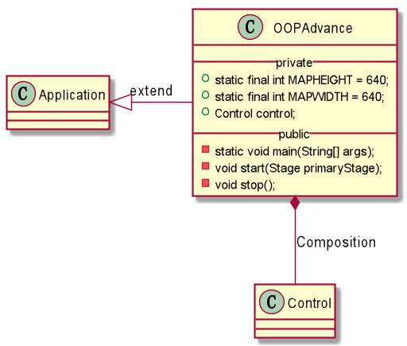

#### 2. com.swt.model.basic包，Model包中的基类或用于复合的类

* **Character类**，为人物基类，统一游戏中所有的角色的共有属性和方法。

    * Character的属性和方法如下：

    |  变量名   |  类型   |               含义               |
    | :-------: | :-----: | :------------------------------: |
    |  picture  | Picture |          人物对应的图片          |
    |   point   |  Point  | 人物的位置(与图片的位置保持一致) |
    | destPoint |  Point  |     人物需要移动到的目标位置     |

    | 方法名                                     | 含义                                           |
    | ------------------------------------------ | ---------------------------------------------- |
    | moveLeft()/moveRight()/moveUp()/moveDown() | 人物的图片往左/右/上/下移动一格                |
    | changePosition()                           | 人物判断哪个方向可以移动，调用对应的move()方法 |
    | moveIsOver()                               | 判断人物当前是否已经移动到目标位置             |

    * **类图**：

    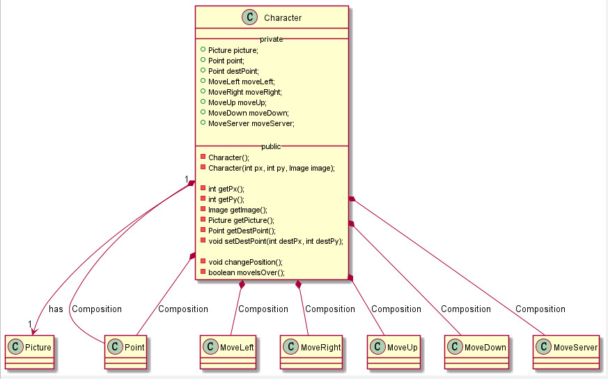

* **Picture类**，图片类，包含图片的内容和图片在地图上的坐标

    * Picture类属性如下：

        | 变量名 | 类型                     | 含义                 |
        | ------ | ------------------------ | -------------------- |
        | image  | javafx.scene.image.Image | 图片本体，用于绘画   |
        | point  | Point                    | 图片所在方格中的位置 |
        | width  | int                      | 图片的宽             |
        | height | int                      | 图片的高             |

    * **类图**：

        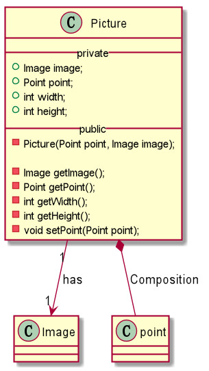

* **Color，Rank类，ENUM类**，用作葫芦娃的颜色和排行属性

* **Point类**，坐标类，封装了横纵坐标，表示在N*N二维空间中的坐标位置。**重写了equals方法**，当横纵坐标相等时即在同一位置。如下为equals方法：

    ```java
    @Override
    public boolean equals(Object obj) {
        if (obj == null){
            return false;
        }
        if (this == obj){
            return true;
        }
        if (obj instanceof Point){
            Point o = (Point) obj;
            return (this.px == o.getPx() && this.py == o.getPy());
        }
        return false;
    }
    ```

#### 3. com.swt.model.advance包，Model包中继承Character的包，代表游戏中的各种基本角色

* **Calabash类**，为葫芦娃类，继承Character类，主要的颜色，排行属性和shout方法在前一次作业中已有解释，故不再赘述。

    * **类图**

        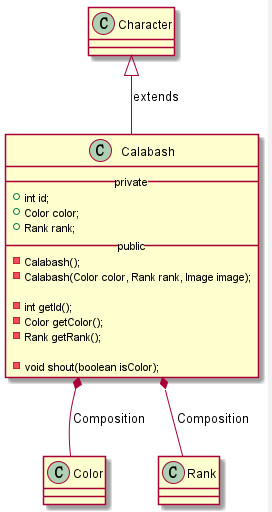

* **Snake类**，即蛇精类，继承Character类，拥有方法Order()，获取新的阵型坐标，命令小喽啰改变阵型。

    * **类图**

        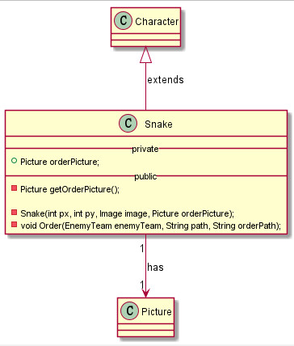

* **SmallEnemy(小喽啰)，Scorpion(蝎子精)类**，均继承Character类。没有特殊方法，故略去UML图

#### 4. com.swt.model.controlled包，游戏中实际被单独控制的实体，包括葫芦娃队伍，敌人队伍，老爷爷和游戏地图。

* **CalabashTeam类**，葫芦娃队伍类，包含了葫芦七兄弟的列表。

    * 类图

        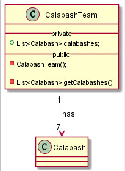

* **EnemyTeam类**，敌人的队伍类，拥有蛇精，蝎子精和小喽啰若干，用于表示敌人队伍，并提供更改阵型的方法。

    * EnemyTeam属性及方法

        | 方法名            | 含义                                             |
        | ----------------- | ------------------------------------------------ |
        | ChangeFormation() | 小喽啰和蝎子精开始阵型，此函数由蛇精发号指令调用 |
        | isChangeOver()    | 判断当前阵型是否改变完成，完成则返回true         |

    * **类图**

        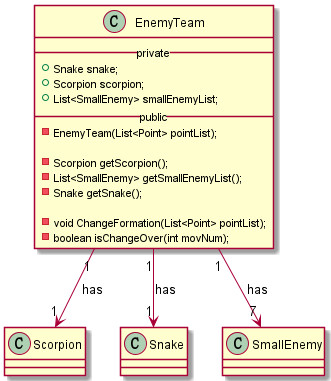

* **NMap类**，即地图类，存储地图绘制的两种图片。两种图片交替绘制。可以进行地图是否被占用的检测和地图上人物位置的变更。

    * NMap属性及方法定义

        | 变量名     | 类型             | 含义                               |
        | ---------- | ---------------- | ---------------------------------- |
        | bufferLock | ReentrantLock    | 锁，用于控制对于地图的修改         |
        | NMap       | int[] []         | 地图，0表示未被占用，非0表示被占用 |
        | N          | static final int | N * N的地图                        |
        | picture1   | Picture          | 绘制地图的第一种格子               |
        | picture2   | Picture          | 绘制地图的第二种格子               |

        | 方法名                          | 含义                                         |
        | ------------------------------- | -------------------------------------------- |
        | changeNMapLeft/Right/Up/Down()  | 修改NMap，在人物移动后同步地图，注意需要加锁 |
        | notOccupiedLeft/Right/Up/Down() | 判断参数Point的左/右/上/下是否有空位置       |

    * **类图**

        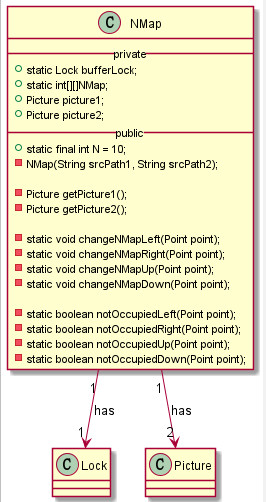

#### 5. com.swt.control包，是应用程序中具体逻辑实现和处理用户交互的部分，在我的程序中为Control类和Formation类。

* **Control类**，负责整体的业务逻辑，完成各个成员对象的初始化并交给MyPaint进行绘画。同时**设置定时器**，每6秒发出信号，使得蛇精命令敌人队伍改变阵型。除了各个操控对象外还有以下属性和方法：

    | 变量名     | 类型    | 含义                             |
    | ---------- | ------- | -------------------------------- |
    | myPaint    | MyPaint | 画笔，在初始化后交由画笔进行绘制 |
    | PointIndex | int     | 下一个变换的阵型的下标           |
    | PointMax   | int     | 阵型总数                         |

    | 方法名     | 含义                          |
    | ---------- | ----------------------------- |
    | setAlarm() | 设置定时器，6秒中改变一次阵型 |

    

    * **类图**

        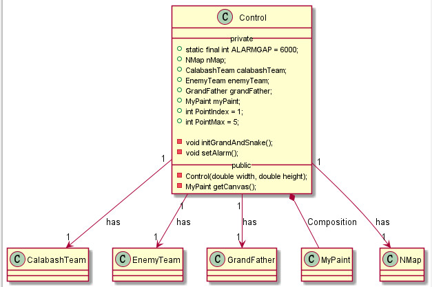

    * 设置定时器的代码如下：

        ```java
        private void setAlarm(){
            EventHandler<ActionEvent> eventHandler = e -> {
                new Thread(new Runnable() {
                    @Override
                    public void run() {
                        //蛇精发号施令，敌人队伍变换阵型
                    }
                }).start();
            };
            Timeline animation = new Timeline
                (new KeyFrame(Duration.millis(ALARMGAP), eventHandler));
            animation.setCycleCount(Timeline.INDEFINITE);
            animation.play();
        }
        ```

* **Formation类**为工具类，通过静态方法读取阵型文件并返回相应的点坐标。

#### 6. com.swt.view包，是应用程序中处理数据显示的部分，在我的程序中为MyPaint类。

* **MyPaint类**，单独用于绘制，封装了绘画线程和各种人物，队伍，地图的绘画，使得数据显示与数据本身分隔开来。数据成员即前述各个类。
  
* MyPaint类属性方法如下：
  
    | 方法名                                                       | 含义                                                         |
    | ------------------------------------------------------------ | ------------------------------------------------------------ |
    | startDraw()                                                  | 开始绘画，启动绘画线程                                       |
    | draw()                                                       | 对于给定的图片进行绘制                                       |
    | drawMap/drawcalabashTeam/ drawenemyTeam/drawSnake/drawGrand() | **地图**，**葫芦娃队伍**，**敌人队伍**，**蛇精**，**老爷爷**的具体绘画，均调用draw()方法 |
    | drawMapStop()                                                | 停止绘画                                                     |
    
* **类图**
  
    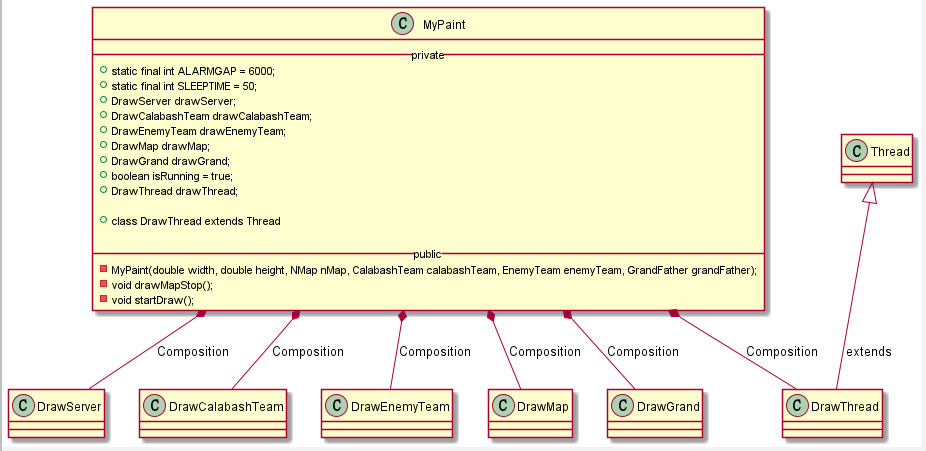
    
* 定义**内部类DrawThread**，表示绘画线程：
  
    ```java
    /**
     * 绘画线程
    */
    private class DrawThread extends Thread{
        @Override
        public void run() {
            while (isRunning){
                Platform.runLater(new Runnable() {
                    @Override
                    public void run() {
                        drawMap();
                        drawcalabashTeam();
                        drawenemyTeam();
                        drawSnake();
                        drawGrand();
                    }
                });
                //画完后休息一段时间，避免阻塞
                try {
                    Thread.sleep(SLEEPTIME);
                } catch (InterruptedException e) {
                    e.printStackTrace();
                }
            }
        }
    }
    ```

#### 7. 整体包结构

```bash
- src
	- com.swt.control
		Control.java
		Formation.java
    - com.swt.model				//MVC中的Model部分
        - basic					//基类或用于复合的类
            Character.java		//人物类
            Picture.java		//图片类
            Point.java			//坐标类
            Color.java			//颜色ENUM
            Rank.java			//排行ENUM
        - advance				//派生类
            Calabash.java		//葫芦娃类
            Scorpion.java		//蝎子精类
            SmallEnemy.java		//小喽啰类
            Snake.java			//蛇精类
        - controlled			//逻辑上被操纵的主体
            CalabashTeam.java	//葫芦娃队伍类
            EnemyTeam.java		//敌人队伍类
            GrandFather.java	//老爷爷类
            NMap.java			//地图类
        - move					//移动
        	MoveInterface		//移动接口
        	MoveLeft			//向左移
        	MoveRight			//向右移
        	MoveUp				//向上移
        	MoveDown			//向下移
        	MoveServer			//移动服务，提供给上层Character
  	- com.swt.view
  		- draw					//绘画接口
  			DrawBase			//绘画基类
  			DrawCalabashTeam	//绘制葫芦娃队伍
  			DrawEnemyTeam		//绘制敌人队伍
  			DrawMap				//绘制地图
  			DrawGrand			//绘制老爷爷
  			DrawServer			//绘制服务，提供给上层Paint
  		MyPaint.java
  	- SRCFile				//使用到的图片
  	OOPAdvance.java		//main函数，构建窗口
```

#### 8. 整体类图

* **完整结构**

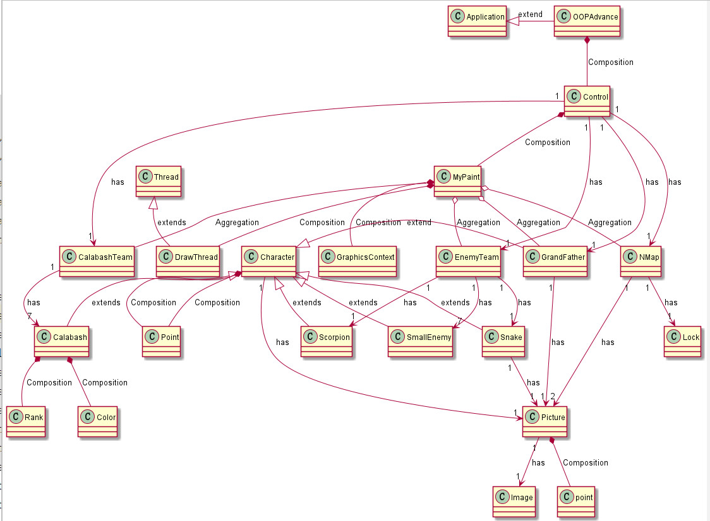

* **整体继承结构**


### 二. 整体逻辑

- 图形化界面使用JavaFX完成。
- 葫芦娃队伍排成长蛇形，老爷爷为其加油，并将加油口号显示在图像上。**蛇精每隔6秒发号一次命令，命令蝎子精队伍变换阵型**，并将口号显示在图像上。
- 阵型来源于Point.txt文件，其中包含了该阵型中每个人的坐标。
- 变换阵型时每个敌人选择一个坐标，每个轮回所有敌人依次往新坐标方向移动一格。移动时需**要判断当前准备移动的位置有没有人**，若无人，则移动。若希望移动的位置有人，则依次从左，右，下，上方向选择一个能够移动的位置进行移动。移动后线程暂停201ms，防止移动过快。
- 目前移动逻辑还不完善，每个人物移动到对应位置后便不再移动，但可能会有人物被已经不再移动的其他人物卡死，这样的情况还未曾考虑。<font color=#0099ff>**但本次作业给出的阵型均能正确改变！**</font>


### 三. 面向对象的概念，机制，设计理念

#### 1. 抽象，封装，继承，多态与复用

* 在程序中有<font color=#aa99ff>**基类Character**</font>，即人物类。
* 封装了Picture和Point类，并在基类Character中复用了Picture和Point，用以表示人物的图片和位置坐标属性。
* 葫芦娃，老爷爷，小喽啰，蛇精，蝎子精等主要人物都继承了Character类，并在此基础上拥有自身的新方法或属性。

* 封装了在逻辑上被操纵的主体，在图片中被显示的主体，即**葫芦娃七兄弟的队伍**和**蝎子精带领的敌人队伍**(老爷爷也被直接操纵，在前面已经提到)。

* 封装了地图类以及对于地图的修改，判断。
* 将所有人物的绘画功能单独封装成MyPaint类，并将人物的绘画抽象成图片的绘画函数draw()，将Picture作为属性复用到人物基类Character中，并对于每个游戏操纵实体调用draw()，实现不同实体的绘画。


#### 2. MVC模式

* 即**Model View Controller**模式，将业务逻辑，数据和界面显示分离。

* **Model（模型）**是应用程序中用于处理应用程序数据逻辑的部分，在我的程序中即所有的人物，地图，图片等类。

* **View（视图）**是应用程序中处理数据显示的部分，在我的程序中为**MyPaint**类，封装了绘画线程和各种人物，队伍，地图的绘画，使得数据显示与数据本身分隔开来。

* **Controller（控制器）**是应用程序中处理用户交互的部分，在我的程序中为Control类和Formation类。

    * Control类负责整体的业务逻辑，完成各个成员对象的初始化并交给MyPaint进行绘画。同时**设置定时器**，每6秒发出信号，使得蛇精命令敌人队伍改变阵型。


### 四. 好处

* **抽象，封装，继承，多态与复用**
    * 封装隐藏了实现细节，有利于代码的复用，使得代码更加模块化。
    * 继承清晰的展现各个人物与基类Character间的层次关系，同意了人物的共有方法，减少了代码的冗余度，减轻了代码维护的难度。
    * Character类，NMap类复用了Point类和Picture类，使得代码更为简洁，属性更为明晰。
* **MVC模式**
    * 有助于管理复杂的应用程序，使得可以在一个时间内专门关注一个方面。例如，在不依赖业务逻辑的情况下专注于视图设计。同时也让应用程序的测试更加容易。
    * 降低了层与层之间的依赖，实现了分层开发，有利于代码的标准化开发。
    * 在本程序中，使得绘画类专门负责所有对象的绘画，将绘画方法从每个对象中剥离开来，更符合现实世界的基本逻辑。让控制器负责整个逻辑的运转，使得业务逻辑的维护更为便捷。


### 五. 代码执行方法及最终效果

* **执行方式**

```bash
# 在cmd中，根目录为：java-2019-homeworks/3-OOPAdvanced/史文泰-171860588
javac -encoding UTF-8 OOPAdvance.java
java OOPAdvance
```

* **效果**

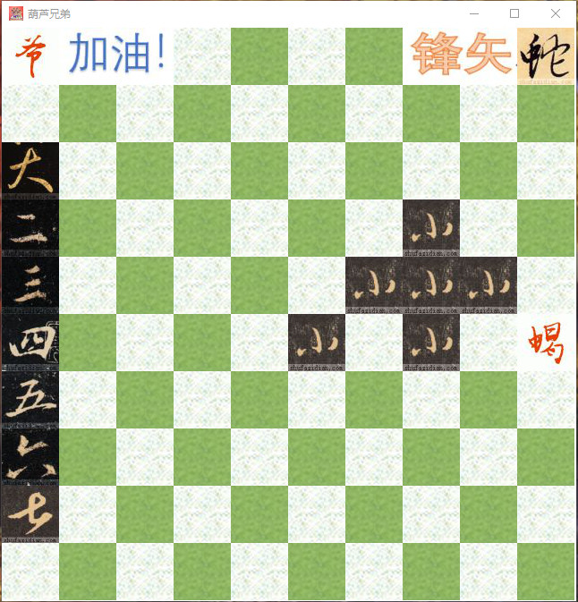